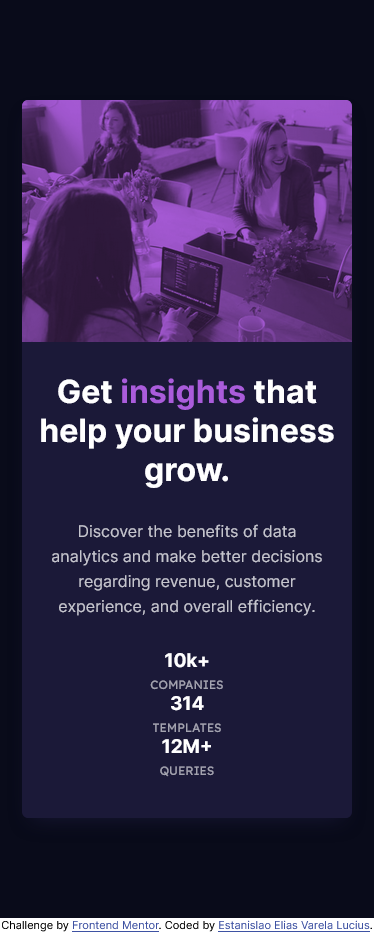

# Frontend Mentor - Stats preview card component solution

This is a solution to the [Stats preview card component challenge on Frontend Mentor](https://www.frontendmentor.io/challenges/stats-preview-card-component-8JqbgoU62).

## Table of contents

- [Overview](#overview)
  - [The challenge](#the-challenge)
  - [Screenshot](#screenshot)
  - [Links](#links)
- [My process](#my-process)
  - [Built with](#built-with)
  - [What I learned](#what-i-learned)
  - [Continued development](#continued-development)
- [Author](#author)

## Overview

### The challenge

Users should be able to:

- View the optimal layout depending on their device's screen size

### Screenshot

Desktop:

Mobile:

### Links

- Solution URL: [link](https://github.com/EstanisEVL/stats-preview-card-component)
- Live Site URL: [link](https://estanisevl.github.io/stats-preview-card-component/)

## My process

### Built with

- HTML5
- CSS custom properties
- Flexbox
- SASS/SCSS
- Mobile-first workflow
- GIT

### What I learned

In this challenge I learned to import fonts from Google Fonts directly into my project. Also I learned to create an overlay to modify the header image's color.

### Continued development

I want to focus more on element sizes in future projects to achieve more precise layout designs, so I can replicate the designs provided faster and more efficiently.

## Author

- Github - [Estanislao Elias Varela Lucius](https://github.com/EstanisEVL)
- Frontend Mentor - [@EstanisEVL](https://www.frontendmentor.io/profile/EstanisEVL)